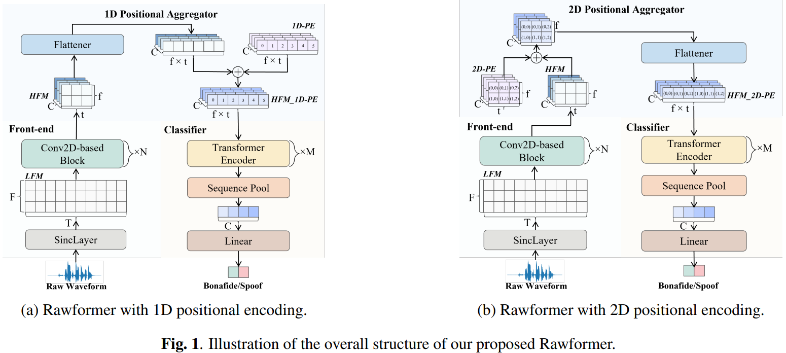

# Rawformer Implementation
This is my own implementation of Rawformer model 
(LEVERAGING POSITIONAL-RELATED LOCAL-GLOBAL DEPENDENCY FOR SYNTHETIC SPEECH DETECTION - Xiaohui Liu, Meng Liu, Longbiao Wang, Kong Aik Lee2, Hanyi Zhang1, Jianwu Dang)  
  
__WARNING__  
This code could be not same as explained in the paper. 
If you find some bugs in this code and want to fix it, please open pull requests.  
  
## Rawformer-S vs Rawformer-L vs SE-Rawformer
In the paper, authors developed three types of Rawformer, Rawformer-S, Rawformer-L and SE-Rawformer. 
All of these models use 1-dimesional positional encoding. 
`N` is the number of Conv2D-based Blocks and `M` is the number of Transformer Encoders.  
  
- Rawformer-S
    - `N` = 4
    - `M` = 2
    - `Conv2D-based Block` - same as a ResNet block used in AASIST
- Rawformer-L
    - `N` = 6
    - `M` = 3
    - `Conv2D-based Block` - same as a ResNet block used in AASIST
- SE-Rawformer
    - `N` = 4
    - `M` = 2
    - `Conv2D-based Block` - replaced blocks of Rawformer-S with Res-SERes2Net blocks for last three blocks
  
